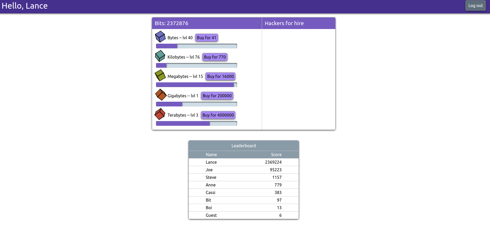

# Bit Clicker

## Clicker/Idler by Lance Smith

### [Live Game Link](https://bit-clicker.herokuapp.com/#/)

### Goal

My main goal was to create a live single page full stack clicker game. I also kept the UI/UX simple and clean while maintaining a consistent look throughout the game. A Mern stack was used to demonstrate my ability with JavaScript across the entire tech stack.

### Tech (Mern Stack)

- MongoDB
  - Stores player data like account info and player progress
- Express.js / Node.js
  - Manages routes for players and saving their progress
- React / Redux
  - Displays all views and tracks state on the client side

### How It Works

1. Players either sign up or log into their existing account
1. Click collect buttons to start timer for each business
1. When the bar fills up the player receives the bits that business pays out
1. Purchasing a hacker for the corresponding business will keep that business going indefinitely
1. Upgrading the business will cause it to pay out more bits each time it is complete
1. Once a business has its hacker purchased it will continue to generate bits even when you are not playing (You will be presented with your earning upon next log in assuming at least 10 seconds have passed)

Sidenote: The game will autosave periodically and you can click the leaderboard to refresh the top scores

### Areas to expand/improve

- Being a clicker/idler, this game will eventually deal with numbers far outside of the range of JS's number data type. A custom number type should be used to store much larger values. My initial thought is to build one that uses a string to store the player's score, then implement the basic arithmetic operations required for this game.

- The game could use a balance pass to ensure the player progression is enjoyable.

- Businesses should have levels at which some additional bonus is unlocked like increased profits or shorter wait times.

- Clickers often have a "prestige" system to give some higher level currency and functionality to achieve

- The saving feature could use some adjustment so that progress is tracked more closely.

- A visual and audio pass. There is little art and no sound effects currently.
